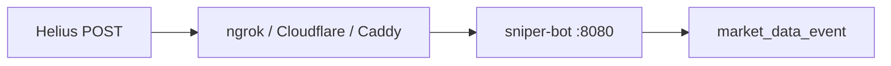

# Helius Webhook Setup

Canonical operator runbook for exposing the sniper-bot Helius webhook ingress (`POST /webhooks/helius`) over **HTTPS**. Ingestion handler and hybrid delivery are implemented in-tree; this guide covers **exposure only** (ngrok, Cloudflare Tunnel, or Caddy on a static IP).

**Related:** [`shared/config/chains.yaml`](../../shared/config/chains.yaml) (`solana.ingestion`), [production gate analysis § webhook](../analysis/2026-05-20-production-gate-analysis.md) (credit rationale), [fortress posture spec](../specs/2026-06-23-fortress-posture-design.md).

### Hybrid gate runs

For production gate collection with hybrid delivery:

1. `./scripts/webhook_enable_hybrid.sh` and rebuild the image (`make start --build` or `make webhook-production`).
2. Configure Helius dashboard webhook to `WEBHOOK_PUBLIC_URL` + `/webhooks/helius`.
3. `make webhook-verify WEBHOOK_PUBLIC_URL=https://...`
4. `make gate-collect MINS=30 MODE=PIPELINE_PROOF` — expect `ingestion_delivery_mode=hybrid` and `helius_webhook_delivered > 0`.

---

## Prerequisites

1. **Helius** account with webhook support.
2. **Hybrid delivery** (recommended): pumpfun-amm via webhook; Raydium/Orca/Meteora stay on stream.

```bash
./scripts/webhook_enable_hybrid.sh
```

This sets:

- `.env`: `SOLANA_INGESTION_DELIVERY=hybrid`, generates `HELIUS_WEBHOOK_SECRET` if missing
- `chains.yaml`: `ingestion.webhook.enabled: true`, `pumpfun-amm` → `delivery: webhook`

3. **Secret** — never put in YAML; only `HELIUS_WEBHOOK_SECRET` in `.env`. Helius `Authorization` header must match exactly.

---

## Exposure modes

| Mode | Command | Best for |
|------|---------|----------|
| **ngrok** | `make webhook-dev` | Local Mac/Linux, staging |
| **Cloudflare Tunnel** | `make webhook-cloudflare` | VPS with static IP, no inbound ports |
| **Caddy + domain** | `make webhook-production` | VPS with static IP + DNS A record |

Default `make start` is unchanged (stream-only, port 8080 on host).



---

## Mode A — ngrok (local / staging)

1. Get authtoken: [ngrok dashboard](https://dashboard.ngrok.com/get-started/your-authtoken)
2. Add to `.env`: `NGROK_AUTHTOKEN=...`
3. Run:

```bash
make webhook-dev
```

4. Copy printed URL + path for Helius:

```
https://<subdomain>.ngrok-free.app/webhooks/helius
```

5. Optional: inspect tunnel at `http://localhost:4040`

**Note:** Free ngrok URLs change on restart. Use a reserved domain on a paid plan for a stable Helius URL.

---

## Mode B — Cloudflare Tunnel (static IP, no open ports)

1. Create a tunnel in [Cloudflare Zero Trust](https://one.dash.cloudflare.com/) → Networks → Tunnels.
2. Add a **public hostname** route to `http://sniper-bot:8080` (Docker service name on the compose network).
3. Copy the tunnel token to `.env`: `CLOUDFLARE_TUNNEL_TOKEN=...`
4. Run:

```bash
make webhook-cloudflare
```

5. Helius webhook URL:

```
https://<your-cloudflare-hostname>/webhooks/helius
```

Set `WEBHOOK_PUBLIC_URL=https://<hostname>` in `.env` for verify scripts and startup logs.

---

## Mode C — Caddy + domain (production on static IP)

1. DNS **A record**: `WEBHOOK_DOMAIN` (e.g. `sniper.example.com`) → your static IP.
2. Router/firewall: forward **TCP 80 and 443** to the Docker host.
3. `.env`:

```bash
WEBHOOK_DOMAIN=sniper.example.com
WEBHOOK_PUBLIC_URL=https://sniper.example.com
```

4. Run:

```bash
make webhook-production
```

Uses [`deploy/webhook/Caddyfile`](../../deploy/webhook/Caddyfile) and [`docker-compose.webhook.yml`](../../docker-compose.webhook.yml) to bind sniper `:8080` to **localhost only** (443 public via Caddy).

5. Helius URL:

```
https://sniper.example.com/webhooks/helius
```

---

## Helius dashboard configuration

1. **Webhooks → New**
2. **URL:** `<WEBHOOK_PUBLIC_URL>/webhooks/helius`
3. **Type:** Raw transaction (lower latency than Enhanced)
4. **Account filter:** `pAMMBay6oceH9fJKBRHGP5D4bD4sWpmSwMn52FMfXEA` (pumpfun-amm)
5. **Authorization header:** same value as `HELIUS_WEBHOOK_SECRET` in `.env`

Changes can take up to ~2 minutes to propagate.

---

## Verification

```bash
# Against public URL (after TLS is up)
make webhook-verify WEBHOOK_PUBLIC_URL=https://your-host

# Against local sniper (auth/path only)
make webhook-verify
```

Expected checks:

- `GET /health` → 200
- `POST /webhooks/helius` without auth → 401
- `POST` with `Authorization: <secret>` → not 401

**Logs** (after Helius delivers an event):

```bash
make docker-logs GREP=helius_webhook
```

Look for:

- `solana_ingestion_webhook_registered`
- `solana_ingestion_webhook_ready` + `public_url_hint`
- `helius_webhook_delivered`
- `solana_ingestion_emitted` with `transport=webhook`

Gate script metrics: `ingestion_webhook_emitted`, `ingestion_delivery_mode` (`scripts/gate_review_collect.sh`).

---

## Rollback to stream-only

1. `.env`: `SOLANA_INGESTION_DELIVERY=stream`
2. `chains.yaml`: `ingestion.delivery: stream`, `webhook.enabled: false`, remove `delivery: webhook` from pumpfun-amm
3. `make stop && make start`
4. Disable or delete the Helius webhook in the dashboard

---

## Security checklist

- `HELIUS_WEBHOOK_SECRET` — env only, never commit
- **Caddy mode:** sniper `8080` not exposed on WAN; only 443 via Caddy
- **Firewall:** allow 443 (and 80 for ACME); block inbound 8080 from internet
- Do not enable global `delivery: webhook` for all programs until gap recovery is wired — see [`gap_recovery.go`](../../sniper-bot/internal/modules/ingestion_solana/gap_recovery.go)

---

## Environment variables

See [`.env.example`](../../.env.example):

| Variable | Purpose |
|----------|---------|
| `SOLANA_INGESTION_DELIVERY` | `stream` \| `hybrid` \| `webhook` |
| `HELIUS_WEBHOOK_SECRET` | Shared secret with Helius |
| `WEBHOOK_PUBLIC_URL` | Full HTTPS base URL for verify + logs |
| `WEBHOOK_DOMAIN` | Caddy TLS hostname |
| `NGROK_AUTHTOKEN` | ngrok profile |
| `CLOUDFLARE_TUNNEL_TOKEN` | cloudflared profile |
| `WEBHOOK_EXPOSURE` | `none` \| `ngrok` \| `cloudflare` \| `caddy` |
